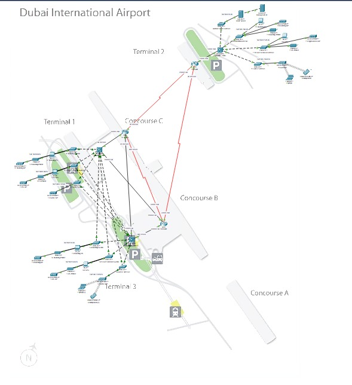

# Introduction

In the contemporary aviation landscape, modern airports necessitate sophisticated network infrastructure to efficiently manage operations, provide essential services to various departments, and elevate the overall passenger experience. This comprehensive project is centered on designing a robust network tailored to the distinct needs of four pivotal airport departments:

1. **Airport Authority**
2. **Flight Service Providers**
3. **Boarding Desks**
4. **Guests**

The primary objective is to ensure secure and seamless communication among these departments while adhering to stringent access restrictions based on their individual requirements. Notably, the Airport Authority oversees a server dedicated to flight controls with restricted access, while Flight Service Providers and Boarding Desks enjoy complete access to this critical server. Guests, on the other hand, are deliberately separated from the internal airport network, provided with wireless internet access via a common password.

## Proposed Solution

### VLAN-Based Network Architecture

The proposed solution embraces a VLAN-based network architecture, a versatile approach that facilitates the segregation of network traffic and robustly enforces access controls.

- **VLAN Segmentation**:
  - **VLAN 2 (Airport Authority)**: Tailored for airport management functions, featuring restricted access to ensure the confidentiality and integrity of critical operations.
  - **VLAN 3 (Flight Service Providers)**: Strategic segmentation to allow limited access, fostering seamless communication with the Airport Authority.
  - **VLAN 4 (Boarding Desks)**: An independent network meticulously isolated to minimize potential security risks, with communication privileges extended to every department except the Airport Authority.
  - **VLAN 5 (Guests)**: A dedicated and isolated network offering internet-only access, designed to safeguard the internal network from potential security threats.

- **Access Controls**:
  - **Airport Authority**: Rigorous access controls are implemented to maintain the confidentiality and integrity of critical operations.
  - **Flight Service Providers**: Granted communication privileges with every department except the Airport Authority, fostering efficient collaboration.
  - **Boarding Desks**: Operate on an isolated network, minimizing security risks while maintaining open communication with every department except the Airport Authority.
  - **Guests**: Completely segregated, restricted to accessing only the internet for public services.

## Problem Statement

### Project Challenges:

1. **Secure Access**:
   - **Challenge**: Designing a network that ensures secure and restricted access for each department.
   - **Solution**: Implementation of VLANs with meticulous access controls tailored to each department's specific requirements.

2. **Communication Control**:
   - **Challenge**: Establishing clear communication channels between Flight Service Providers, Boarding Desks, and Airport Authority.
   - **Solution**: Precise definition of access rules to facilitate seamless communication based on departmental needs.

3. **Guest Isolation**:
   - **Challenge**: Creating a separate network for guests to prevent unauthorized access to internal systems.
   - **Solution**: Implementation of VLANs and access controls to isolate guest traffic from internal networks.

4. **Scalability**:
   - **Challenge**: Designing a scalable network to accommodate future expansion and technological advancements.
   - **Solution**: Adoption of a flexible network architecture capable of adapting to evolving airport needs.

## Technologies Used

- **Routers**: Leveraged for interconnecting different VLANs, facilitating seamless communication and ensuring efficient traffic flow.
- **Switches and VLANs**: Employed to establish logical segmentation of the network, optimizing performance and security.
- **Multilayer Switch**: Implemented for inter-VLAN routing, enabling efficient communication between different departments.
- **EIGRP Routing Protocol**: Deployed to optimize routing within the network, ensuring rapid and reliable data transfer.
- **DHCP Server**: Strategically placed to dynamically assign IP addresses, simplifying network management.
- **Static IP Assignment**: Utilized for critical devices to ensure stability and predictability in their network addresses.
- **Guest Access Points**: Configured to provide wireless internet access to guests while maintaining a secure separation from the internal network.
- **Inter-VLAN Routing**: Facilitates communication between different VLANs, ensuring efficient data transfer.
